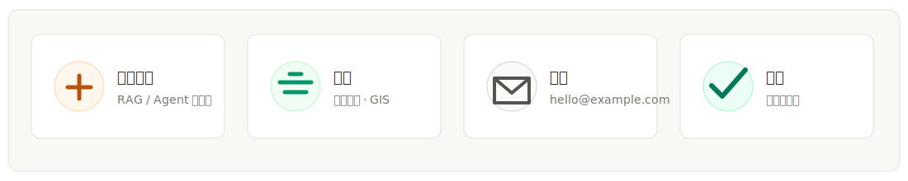
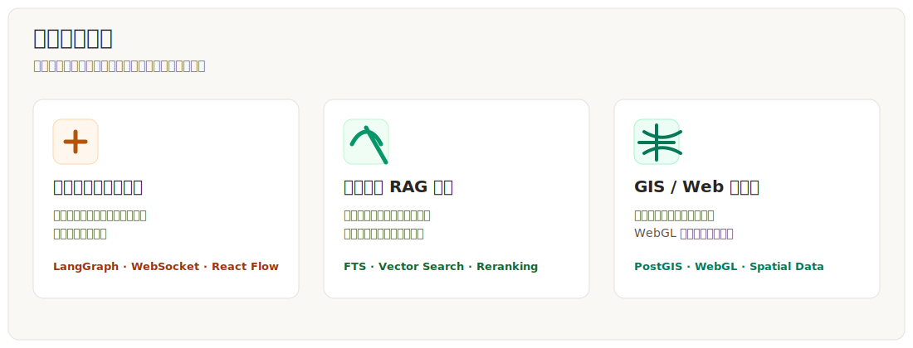
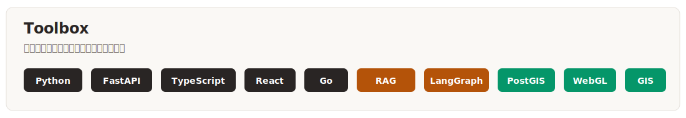
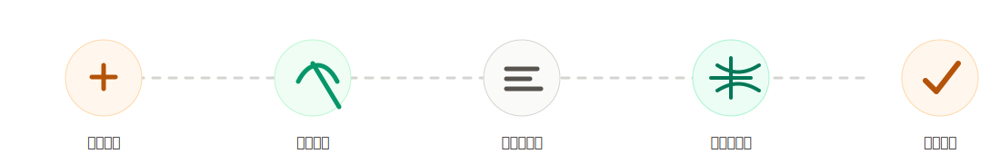

<div align="center">


</div>

## 你好，我是 GeoSyntax

我是一名正在成长中的 **Python / Agent / RAG 应用开发者**，有地理信息与空间数据方向的学习背景。相比只做单点功能，我更关注一条完整链路：如何把资料检索、任务拆解、后端服务和前端可视化组合成可以长期维护的系统。

目前我主要在做三类事情：

- 用 **Agent 工作流** 组织复杂任务，让规划、搜索、分析和写作过程可追踪；
- 用 **RAG 系统** 整理专业文档和代码资料，让知识库不仅能问答，也能调试和迭代；
- 用 **GIS / Web 可视化** 表达空间数据，把专业背景和 AI 应用工程结合起来。



> 说明：学校和邮箱当前使用占位内容，后续会替换成确认可公开的信息。

## 我的方向


我希望主页让别人快速知道：我不是只会堆技术名词，而是在尝试把一个问题从“想法”推进到“可运行、可解释、可维护”的工程结果。

```text
输入：一个复杂问题、一批文档资料、一个领域场景
过程：任务拆解 → 检索资料 → 组织上下文 → 生成结果 → 前端展示 → 记录复盘
输出：可演示的原型、清晰的文档、可继续维护的代码结构
```

## 项目经历



### Multi-Agent 智能研究助手

围绕复杂问题研究场景，尝试把一个问题拆成规划、搜索、分析和写作几个阶段。这个项目让我重点理解了：Agent 不只是调用模型，而是要设计状态、流程、工具输入输出和前端可观察性。

- 关注点：任务规划、并行搜索、结构化结果、执行状态展示；
- 技术点：LangGraph、搜索工具、WebSocket、React Flow；
- 收获：对“多步骤 AI 应用如何落地成产品界面”有了更清晰的认识。

### IDL / 领域文档 RAG 面板

围绕专业文档、脚本示例和代码资料，搭建检索增强问答面板。重点不是简单接入向量库，而是把全文检索、向量检索、融合排序和重排策略组合起来，让结果更可解释。

- 关注点：知识库组织、检索质量、流式问答、用户隔离；
- 技术点：FastAPI、SQLite FTS、LanceDB、RRF、SSE、React；
- 收获：对 RAG 系统的检索链路、降级策略和调试体验有了实践理解。

### GIS / Web 可视化练习

基于地理信息方向的学习背景，持续整理空间数据、地图交互和 Web 可视化相关能力。这个方向是我和普通 Web 项目区分开的长期标签。

- 关注点：空间数据表达、地图交互、WebGL 场景、空间数据库；
- 技术点：PostGIS、WebGL、Web GIS、前端可视化；
- 收获：更清楚如何把 AI 应用和空间数据场景结合起来。

## 技术栈



| 方向 | 主要技术 |
| --- | --- |
| Python 后端 | Python, FastAPI, SQLAlchemy, SQLite, 自动化脚本 |
| RAG 检索 | FTS, Vector Search, RRF, Reranking, Domain Knowledge Base |
| 前端工程 | TypeScript, React, React Flow, TanStack Query, Vue |
| 工具开发 | Go, JavaScript, CLI tooling, Browser scripts, Protocol adapters |
| GIS 可视化 | Spatial data, Web GIS, WebGL, PostGIS, Map interaction |

## 我如何做项目



我比较重视项目的后半段：文档、复盘、可运行性和后续维护。一个项目如果只能跑一次，但别人看不懂、复现不了，我会认为它还没有完成。

```text
先把问题讲清楚
再把流程拆明白
然后做出可运行原型
最后补文档、记录问题、持续维护
```

## 当前状态

| 内容 | 状态 |
| --- | --- |
| 个人主页 | 正在调整成更像“对外介绍我”的主页，而不是单纯技术展示页 |
| 项目链接 | 暂时不直接放仓库列表，先补 README、截图、运行方式和隐私检查 |
| 学习记录 | 使用私有记录按周维护，保持真实提交，不刷贡献图 |
| 独立作品集 | 本地版本已搭建，后续可发布成更完整的网页作品集 |

## 公开原则

- 主页要先介绍“我是谁、我在做什么、我有什么项目经历”；
- 具体仓库链接等整理完成后再逐步展示；
- 学校、邮箱等信息先用占位内容，确认后替换；
- 不公开真实身份细节、本地文件和未经复查的项目内容。

---

<div align="center">

**Agent 工作流 · RAG 系统 · 自动化工具 · GIS / Web 可视化**

</div>
